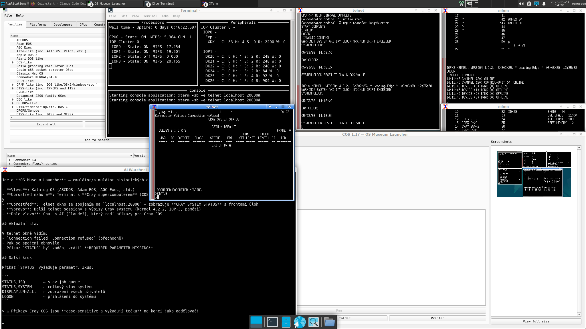

# AI Watcher

> A lightweight AI assistant that looks at your desktop (or focused window) on a keyboard shortcut and tells you what's going on.
> Local, serverless – sends the screenshot directly to the Anthropic Claude API.

The workflow is simple: you're in a terminal, IDE, or browser, you hit an error or unexpected behaviour, you press **Super+A**, and within a few seconds Claude writes into a log what it sees and what to do about it.



*A typical work session – several terminals, an emulator, and the AI Watcher log viewer waiting in the corner.*

## Features

- **Four keyboard shortcuts** for different scenarios:
  - **Super+A** – screenshot of the focused window + default question ("what do you see, what to do next?")
  - **Super+Shift+A** – same, but the whole desktop
  - **Super+Q** – window screenshot + zenity dialog asking for your own question
  - **Super+Shift+Q** – same, but the whole desktop
- **Live log viewer** auto-starts on the first shortcut press (xterm running `tail -f`); response history stays visible
- **Window title in context** – with `--window`, `xdotool` extracts the active window's title and passes it to Claude as context (helps it identify the app quickly)
- **No popup at keypress** – nothing new opens on the screen when you press the shortcut, so `scrot --focused` captures *your* window, not AI Watcher's
- **Robust setup**:
  - Auto-installs missing dependencies (`apt`, `pip`)
  - Validates the API key (format check + live ping to Anthropic)
  - Tracks the verified key by SHA-256 hash → re-validates only after a key change
  - On failure opens a zenity dialog with instructions and an "Open editor" button
- **Secure**: API key lives in `~/.config/ai-watcher/env` with `chmod 600`, never in code

## Requirements

- **OS**: Debian/Ubuntu + XFCE (tested on Debian 12; other distros/DEs need manual shortcut registration)
- **System packages**: `scrot`, `xterm`, `zenity`, `xdotool` (the installer pulls them in)
- **Python 3** with the [`anthropic`](https://github.com/anthropics/anthropic-sdk-python) module
- **An Anthropic API key** ([console.anthropic.com](https://console.anthropic.com/settings/keys))

## Installation

```bash
git clone https://github.com/ruzaq/ai-watcher.git
cd ai-watcher
./install.sh
```

The installer:
1. Installs missing APT and Python packages
2. Copies scripts to `~/bin/ai-watcher/`
3. Creates a template at `~/.config/ai-watcher/env` (chmod 600)
4. Optionally registers the XFCE shortcuts

Then add your API key:
```bash
mousepad ~/.config/ai-watcher/env   # or any editor
```

On the first shortcut press the key is verified against the API once (~2 s).

## Usage

Press a shortcut → the answer appears in the **AI Watcher Log** xterm window, which opens automatically if it isn't running.

You can also auto-start the viewer at login via XFCE Autostart:
- Settings → Session and Startup → Application Autostart → Add
- Command: `~/bin/ai-watcher/ai-watch-log.sh`

## Architecture

```
~/bin/ai-watcher/
├── ai-watch.sh      – default question; calls the Python script directly
├── ai-ask.sh        – shell takes the screenshot → zenity dialog → Python with --image
├── ai-watch-log.sh  – idempotent xterm running tail -f (auto-started)
├── ai-watch-lib.sh  – shared library (env loading, dependency check, error reporting)
└── ai_watcher.py    – communication with the Anthropic SDK

~/.config/ai-watcher/
├── env                              – API key (chmod 600, secret)
└── config                           – preferences (language, model, prompt)
~/.local/share/ai-watcher/
├── log.log                          – append-only response history
└── verified-key.sha256              – hash of the last verified key
```

The shell scripts use auto-discovery (`dirname "${BASH_SOURCE[0]}"`) to find
their siblings, so you can move the install dir anywhere – just remember to
update the XFCE shortcut commands too.

### Important design detail: order of operations in `ai-ask.sh`

The screenshot **must** happen before the zenity dialog. If the dialog opened first it would steal focus and `scrot --focused` would capture zenity instead of the target window. So:
1. `scrot` – the target window still has focus
2. `zenity --entry` – ask the user
3. `python3 ai_watcher.py --image` – send the ready-made image

## Configuration

User preferences live in `~/.config/ai-watcher/config` (created from
[`config.example`](config.example) on first install). The file is shell syntax
with `export` statements; lines starting with `#` are ignored.

| Variable | Default | What it does |
| --- | --- | --- |
| `AI_LANG` | `English` | Language of the reply (e.g. `Czech`, `German`). Used inside the default system prompt. |
| `AI_SYSTEM_PROMPT` | *(unset)* | Replaces the whole system prompt verbatim. Overrides `AI_LANG`. |
| `AI_DEFAULT_QUESTION` | `What do you see? What should I do next?` | Question used when `--otazka` isn't given. |
| `AI_MODEL` | `claude-sonnet-4-6` | Model for real queries. See [available models](https://docs.anthropic.com/en/docs/about-claude/models). |

Example for a Czech reply:
```bash
echo 'export AI_LANG="Czech"' > ~/.config/ai-watcher/config
```

For custom personas/behaviour, set `AI_SYSTEM_PROMPT`. The Anthropic
[system prompt guide](https://docs.anthropic.com/en/docs/build-with-claude/prompt-engineering/system-prompts)
explains what to write.

The verification ping in `ai-watch-lib.sh` (function `_ai_verify_key_once`)
uses `claude-haiku-4-5-20251001` and isn't affected by `AI_MODEL` – we want
the cheapest model for the one-off key check.

### Change the shortcuts

Either via XFCE Settings → Keyboard → Shortcuts, or directly:
```bash
xfconf-query -c xfce4-keyboard-shortcuts -l | grep ai-watch
```

## Security

- Never hard-code the API key in scripts – it belongs in `~/.config/ai-watcher/env`
- `chmod 600` is auto-enforced on every load
- `.gitignore` excludes env, log, and marker files
- The screenshot is sent to the Anthropic API – **don't use it with sensitive content on screen** (passwords, private keys, personal data)

## Uninstall

```bash
./uninstall.sh
```

Removes scripts from `~/bin/` and the XFCE shortcuts. Data under `~/.config` and `~/.local/share` is left intact (delete manually if you wish).

## License

MIT – see [LICENSE](LICENSE).
